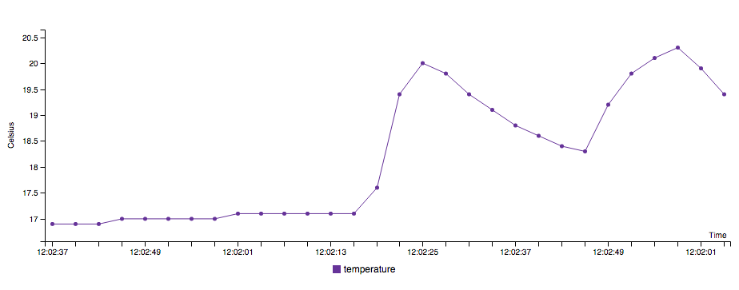
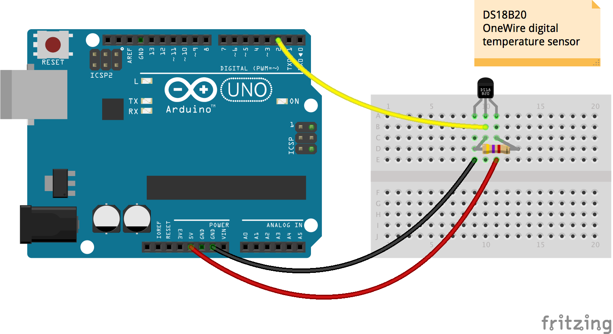
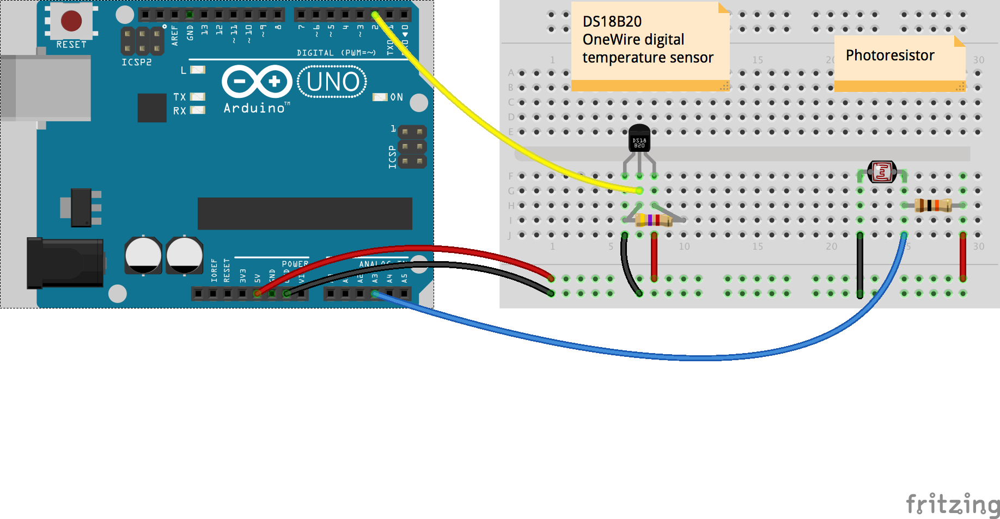
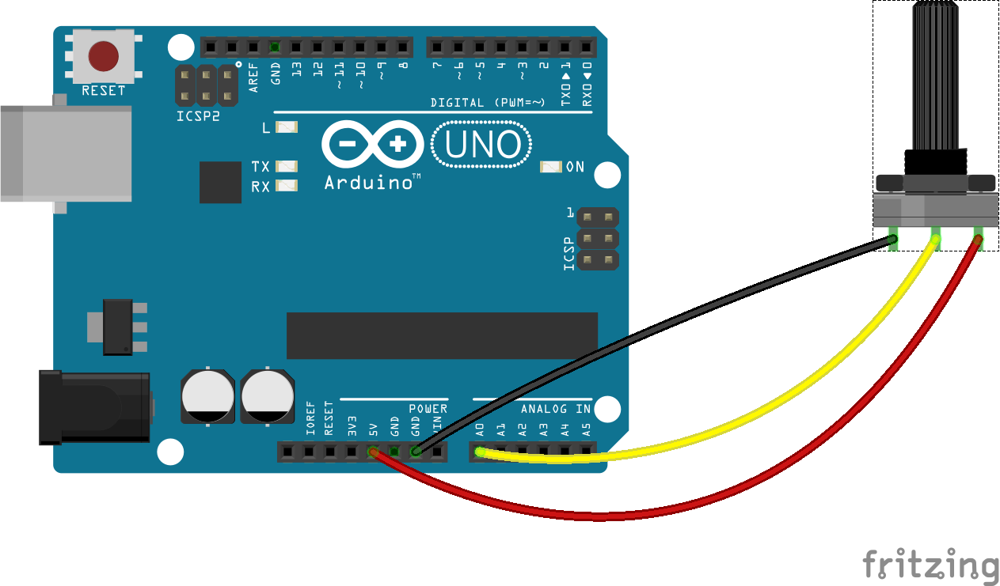
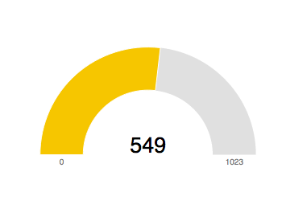
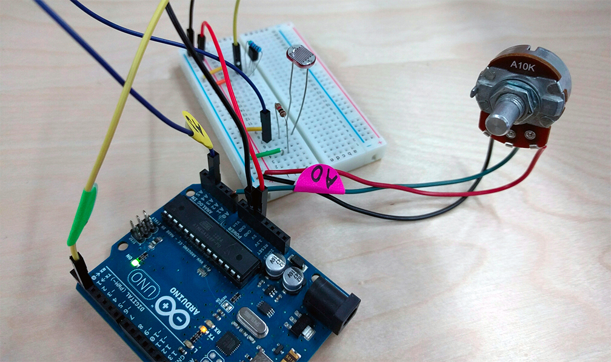

# EON Demo from sensor data using Arduino and Johnny-Five

You need to install *Johnny-Five* and *PubNub* to run the node.js code with Arduino.

```bash
$ npm install johnny-five
```

```bash
$ npm install pubnub
```

## Overview on Publishing from Hardware & Subscribing to Plot a Graph on Browser

### Publishing the Sensor Data to PubNub

Once you get the data from the sensor, send the data to PubNub.

```javascript
var pubnub = require('pubnub')({
  publish_key: 'YOUR_PUB_KEY',
  subscribe_key: 'YOUR_SUB_KEY'
});

var data = {
  'temperature': temp
};

pubnub.publish({
  channel: 'temperature-ds18b20',
  message: data,
});

```

### Data Visualization with EON

The basic graph can be drawn with EON's `chart()` as it receives the data from PubNub.

Chart type can be specified with `data.type`. In this example, it is a simple line graph:

```html
<div id="temp"></div>
```

```javascript
var pubnub = PUBNUB.init({
  publish_key: 'YOUR_PUB_KEY',
  subscribe_key: 'YOUR_SUB_KEY'
});

eon.chart({
  channel: 'temperature-ds18b20',
  generate: {
    bindto: '#temp', 
    data: {
      type: 'line'
    }
  }
},
pubnub: pubnub,
transform: function(m) {
  return { eon: {
      temperature: m.temperature
    }}
  }
});
```

To customize the chart (e.g. changing line colors, adding labels, etc.), please refer [C3.js docs](http://c3js.org/gettingstarted.html#customize).


#### Run the HTML File

For eaxmple, to view the temperature line graph, run `/temperature/temperature.html` file on local server:

```bash
$ python -m SimpleHTTPServer 8000
```

Then go to `localhost:8000` on browser, and run `temperature.html`



## Hardware Wiring

### Temperature

The temperature data comes from a [DS18B20](http://www.maximintegrated.com/en/products/analog/sensors-and-sensor-interface/DS18S20.html) sensor, and it is published to PubNub.

When you are using Arduino with Johnny-Five, you need to install **ConfigurableFirmata** to your Arduino to be able to run the code. The code requires OneWire support using the ConfigurableFirmata.


#### Installing ConfigurableFirmata

1. Connect your Arduino to computer with a USB cable
2. On Arduino IDE, go to **Sketch** > **Include Library** > **Manage Libraries**
3. Search for "ConfigurableFirmata"
4. Click the result, then click **Install**
5. Go to **File** > **Examples** > **ConfigurableFirmata**
6. Upload the code to the device

#### Arduino Wiring





#### Run the Node.js to Get Temperature from the Sensor

Change directory to *temperature/* and run *temperature.js*:

```bash
$ node temperature.js
```


### Photoresistor (Ambient Light Sensor) with DS18B20

Both a photoresistor a temperature sensor and the same breadboard to send both values to PubNub together:




### Potentiometer 



For potentiometer, I am using a *gauge* chart, instead of line graph.

Define the chart type, `gauge` (also label, min/max, ect.) in the eon settings:

```javascript
eon.chart({
  channel: 'potentiometer',
  generate: {
    bindto: '#pot',
    data: {
      type: 'gauge',
    },
    gauge: {
      label:{
        format: function(value, ratio){
          return value; //returning here the value, not in %
        },
      },
      min: 0,
      max: 1023
    },
  } ...
```



---

### DS18S20, Photoresistor, and Potentiometer in one breadboard


